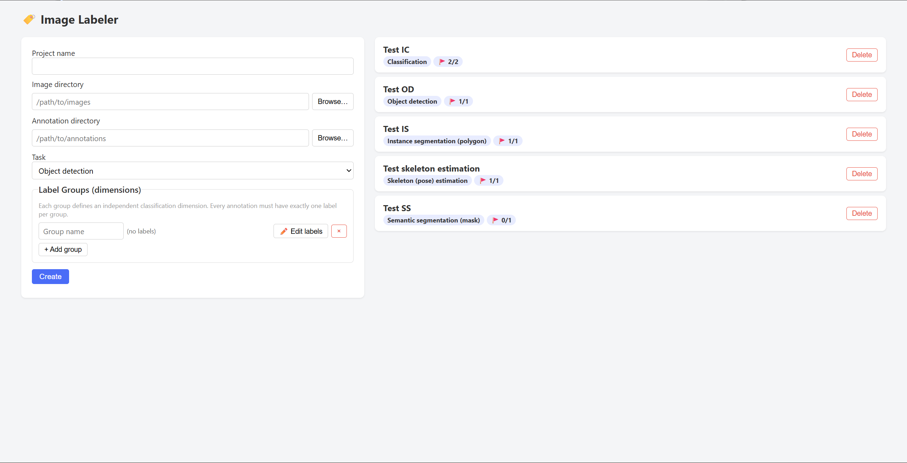
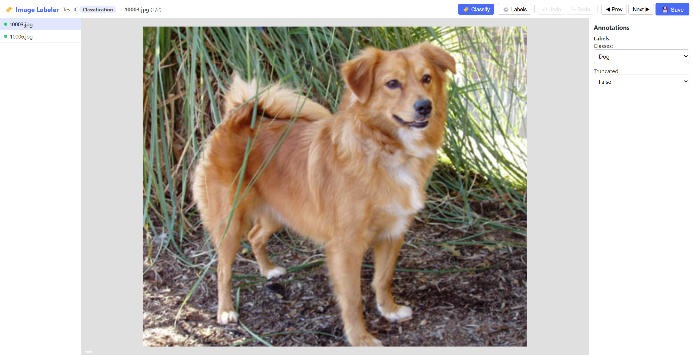
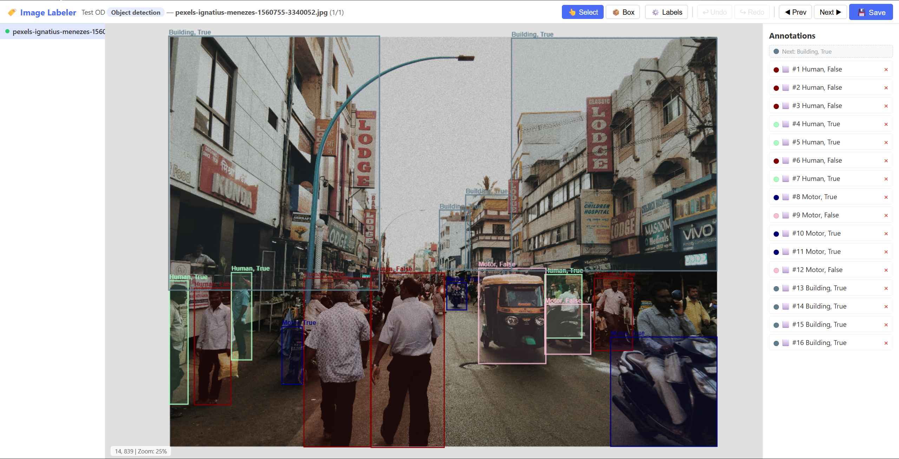
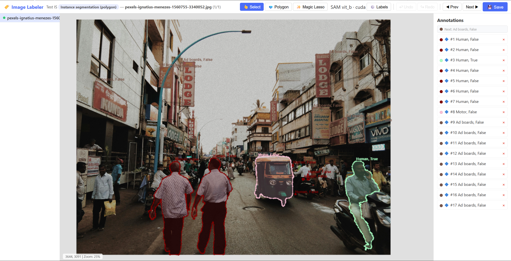
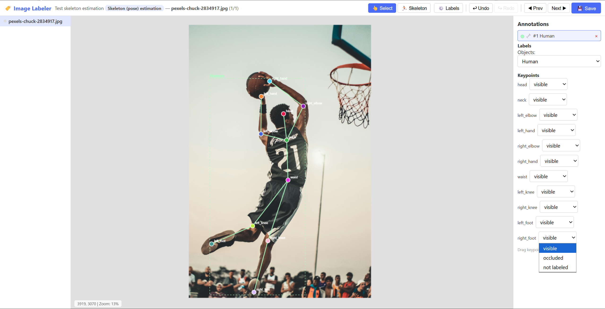

# Image labeler

Image labelling tool for computer vision tasks, annotation in format of Ultralytics YOLO


## Install

Create and activate a Python virtual environment.

Run the following command in terminal.

```
pip install -r requirements.txt --extra-index-url https://download.pytorch.org/whl/cu130
```


## Usage

Activate Python virtual environment.

Run the following command in terminal.

```
python app.py
```

The program will call the default browser and open the interface.



### Features

This program supports multi-dimensional labels. For example, besides object classification, the user can create a label group "truncated" and classify true or false. **Label groups are supported in all tasks.** Each combination of classes is assigned a unique class ID in YOLO format.

>   Q: In object detection or instance segmentation, if an object is truncated by the edge of image, or partially hide behind the tree, should I draw the box or polygon to where I predict it ends?
>
>   A: No, you should draw the box or polygon to exactly where they're visible. In addition, you shouldn't abandon labelling it unless the visible part is below 15% of the whole object, or even human cannot recognize the object by visible portion, because training data is valuable.
>
>   Q: Should I set a separate class for truncated items?
>
>   A: No, the truncated and untruncated objects are in the same class. Separating them will dilute the probability that the class appears. You should set an additional attribute to define whether it is truncated. In this program, multiple image groups solve this problem.

Shortcuts:

-   `A`  Go to previous image
-   `D`  Go to next image
-   `Ctrl+S`  Save
-   `Ctrl+Z`  Undo
-   `Ctrl+Y`  Redo
-   `Del`  Delete selected annotation

Mouse wheel scroll: zoom in and zoom out the image

Select tool: pad (move) the image

Polygon:

-   [Right click] close the current polygon (connect the last vertex to the first vertex)
-   `Esc`  cancel the current points which haven't generate a polygon (cannot remove individual point before predicting)
-   [Drag] vertex to adjust a finished polygon
-   [Double click] edge of a finished polygon to add a vertex
-   [Double click] vertex of a finished polygon to remove the vertex

Magic lasso:

*When opening a project  for the first time, whose type supports magic lasso, the program downloads ~375MB segment model from GitHub. Monitor the terminal output to diagnose any error. When the text at the right of "magic lasso" button shows "embedding", don't work on the page. When the text shows "ready", the magic lasso tool is available to use.*

-   [Left click] include the point (green) into the polygon
-   [Right click] exclude the point (red) outside of the polygon
-   `Esc`  cancel the current points which haven't generate a polygon (cannot remove individual point before predicting)
-   `Enter`  confirm and predict the polygon

### Annotation

Annotation folder structure:

```
annotation/
  - data.yaml
  - labels/
      - image1.txt
      - ...
```

It contains a metadata file and `labels` folder. In `labels` folder, each text file has a corresponding image of the same base name. The content of text file is described in "annotation format" in the section of each task.

`data.yaml` format:

```
path: annotation/
train: .
val: .
names:
  0: Cat_True
  1: Cat_False
  2: Dog_True
  3: Dog_False
nc: 4
class_ids:
- 0
- 1
- 2
- 3
label_groups:
- group_id: 0
  name: Classes
  labels:
  - label_id: 0
    name: Cat
    description: ''
  - label_id: 1
    name: Dog
    description: ''
- group_id: 1
  name: Truncated
  labels:
  - label_id: 0
    name: 'True'
    description: ''
  - label_id: 1
    name: 'False'
    description: ''
```

Edit labels:

-   If swapping the text of two classes in front end, class ID aren't changed. The meaning of class ID will be re-interpreted.
-   If deleting a class, remove cited annotations and rewrite, keeping the meaning of class ID unchanged. Be caution as this action is slow.
-   When adding a new class, it is allocated an unused class ID.

## Modules

### Image classification



Annotation format:

A single integer, class ID. 

Example:

```
3
```


### Object detection



Annotation format:

A matrix of class ID and bounding box coordinators (scale 0~1), which fits YOLO standard.

Example:

```
3 0.304857 0.794940 0.122044 0.411899
3 0.434528 0.789219 0.133486 0.425884
3 0.810672 0.677346 0.069603 0.176710
2 0.719139 0.657640 0.067696 0.155098
2 0.015955 0.745995 0.034325 0.301297
...
```

### Instance segmentation



Annotation format:

A matrix of class ID and polygon vertices' coordinators (scale 0~1), which fits YOLO standard.

Example:

```
1 0.314869 0.603526 0.311264 0.604487 0.306456 0.607051 0.301408 0.612820 0.298283 0.617308 0.297081 0.623077 0.297081 0.633013 ...
1 0.434856 0.588462 0.429808 0.591026 0.426923 0.594872 0.422115 0.614423 0.420913 0.624679 0.420673 0.632051 0.423077 0.639423 ...
0 0.890322 0.602160 0.886236 0.604404 0.883111 0.608571 0.880226 0.614660 0.877582 0.623955 0.878303 0.634212 0.879986 0.639340 ...
```

### Skeleton detection



The skeleton is an undirected graph in mathematics. When creating a project, skeleton configuration defines the topology. In this image, vertex names are:

```
head
neck
left_elbow
left_hand
right_elbow
right_hand
waist
left_knee
right_knee
left_foot
right_foot
```

Edges are:

```
0-1,1-2,2-3,1-4,4-5,1-6,6-7,6-8,7-9,8-10
```

The numbers are the index of vertex (starting from 0) in the vertex names list. Two digits and a dash defines the starting vertex, edge, and the ending vertex, separated by comma.

The undirected graph defines the skeleton (simplified) of a human that connects each part together.

Each vertex has 3 visibility status:

-   Visible: The object is fully or mostly visible in the image.
-   Occluded: The object is partially hidden by another object. Following COCO dataset, if a key point (vertex) is physically absent (not covered by other objects), still consider it as "occluded".
-   Not Labeled: The object exists in the image but is intentionally excluded from annotation.

In this program, a project can only has 1 skeleton topology graph, but can have multiple classes.

Annotation format:

A matrix of class ID, coordinators of the bounding box, key point's coordinators and visibility status, which fits YOLO standard.

Example:

```
0 0.390986 0.577549 0.517712 0.787862 0.515891 0.325833 2 0.550216 0.438978 2 0.399568 0.391940 2 0.388126 0.259725 2 0.639842 0.285151 2 0.435800 0.193618 2 0.534961 0.586448 2 0.346173 0.756801 2 0.435800 0.802568 2 0.142131 0.798754 2 0.344266 0.961480 2
```

### Semantic segmentation

(Not fully implemented)

Semantic segmentation is similar to instance segmentation, but have several additional requirements:

-   Each class has a mask, and don't distinguish individuals in the same class.
-   Every pixel should have a class. If not fully covered, the results cannot be saved.
-   Masks of every class cannot overlap.

In this program, if two annotation overlaps, the one which is labeled prior to the other covers the overlapped area.

Annotation format:

Each class corresponds to a `*.npy` file, which is a 2D bool `numpy` matrix, saving the mask.
