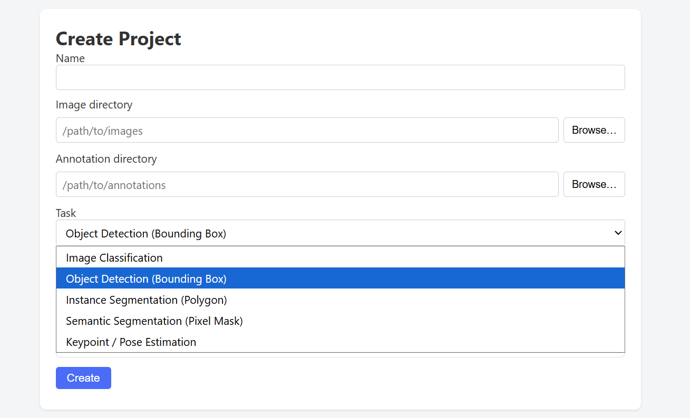
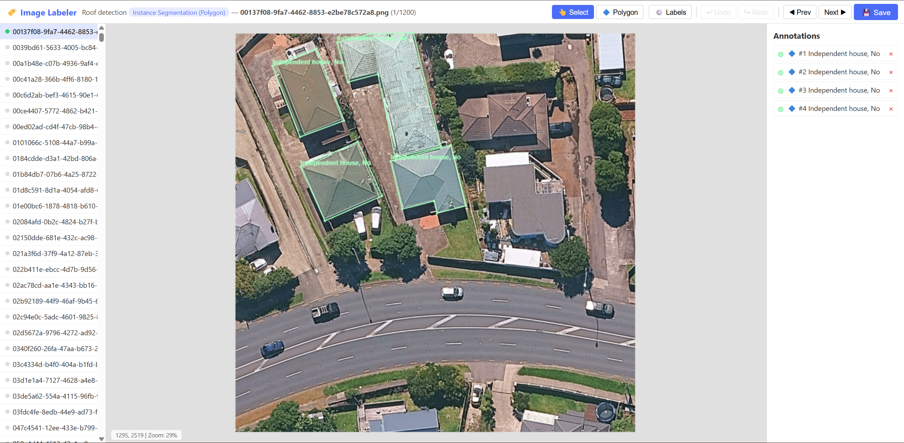
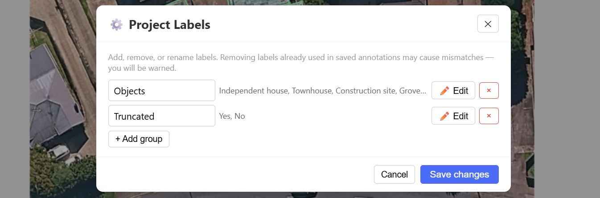
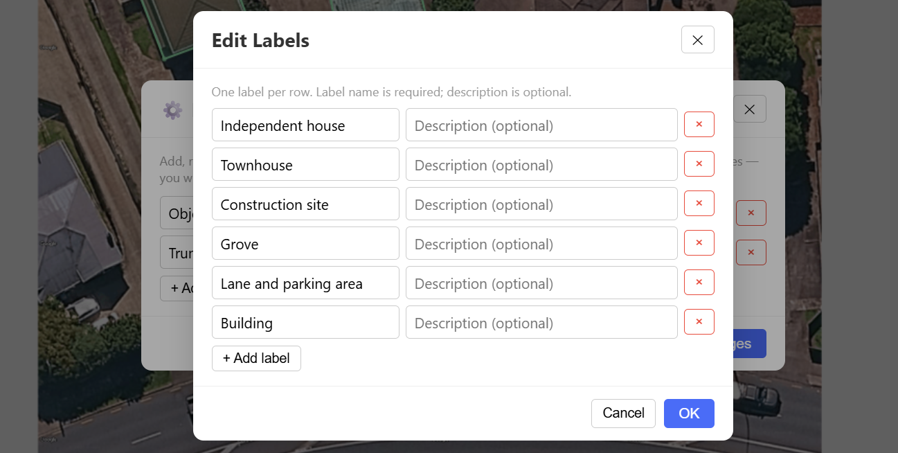
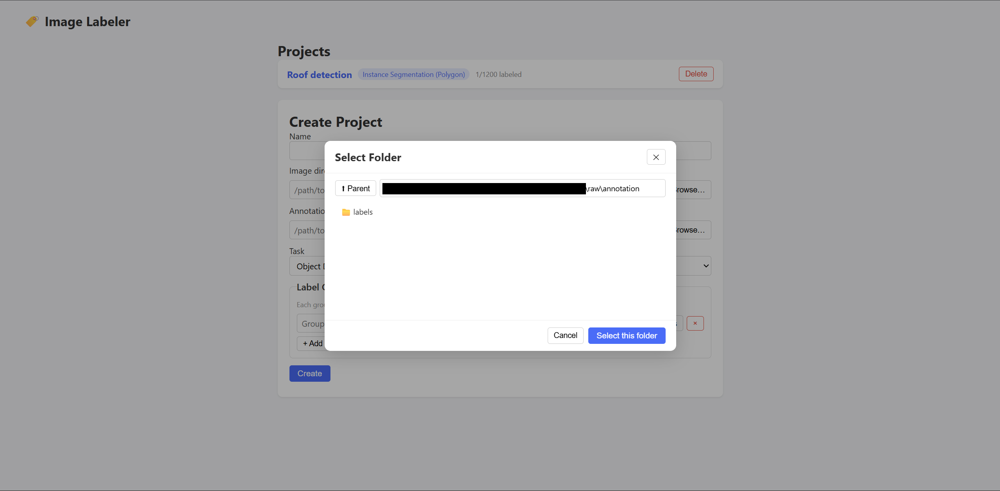

# Image labeler

Image labelling tool for computer vision tasks, annotation in format of Ultralytics YOLO


## Install

Create and activate a Python virtual environment.

Run the following command in terminal.

```
pip install -r requirements.txt
```


## Usage

Activate Python virtual environment.

Run the following command in terminal.

```
python app.py
```


## Features

A lightweight, self-hosted image annotation tool built with Flask and vanilla JavaScript. Designed for small-to-medium labeling tasks where spinning up a full-scale platform is overkill.

### Multi-task Annotation

Supports five annotation task types within a single application:
| Task | Description |
|------|-------------|
| **Detection** | Bounding box (BBox) annotation |
| **Instance Segmentation** | Polygon annotation with vertex editing |
| **Semantic Segmentation** | Brush/eraser mask painting |
| **Skeleton / Pose** | Keypoint placement with configurable skeleton edges |
| **Classification** | Image-level labeling without spatial markup |



### Canvas Interaction

- **Pan & zoom** on any tool — scroll to zoom, drag on empty space to pan, middle-click always pans
- **Vertex editing** — drag polygon vertices to reshape; double-click an edge to insert a vertex, double-click a vertex to delete it
- **Undo / redo** — full history stack (`Ctrl+Z` / `Ctrl+Y`)
- **Keyboard shortcuts** — `A`/`D` to navigate images, `Delete` to remove selected annotation, `Ctrl+S` to save



### Smart Labeling Workflow
- **Sticky labels** — the tool remembers your current label selection so you can label consecutive objects of the same category without re-picking from dropdowns
- **Consistent colors** — annotations with the same label combination always share the same color, making it easy to visually verify class distribution at a glance
- **Live label editing** — add new classes on the fly via the ⚙️ button without leaving the annotation view; removal warnings protect against accidental data loss





### Project Management
- **Folder browser** — built-in server-side directory picker; starts from the previously selected path or falls back to the user's home directory
- **Multi-group labels** — define multiple label groups (e.g., *category* × *occlusion* × *truncation*) that combine as a Cartesian product
- **YOLO-compatible export** — annotations are stored in YOLO-format `.txt` files; a `data.yaml` is generated automatically for training
- **Progress tracking** — thumbnail strip with labeled/unlabeled status dots



### Deployment
- **Zero external dependencies on the frontend** — no React, no npm; pure HTML/CSS/JS
- **Single-file server** — one `app.py`, one `annotate.js`, standard Flask templates
- **Local-first** — runs on `localhost`; all data stays on your machine

